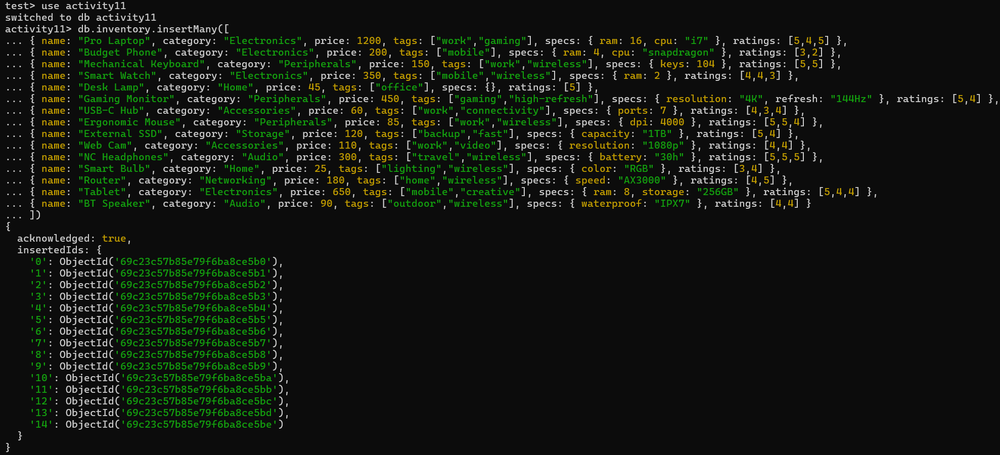
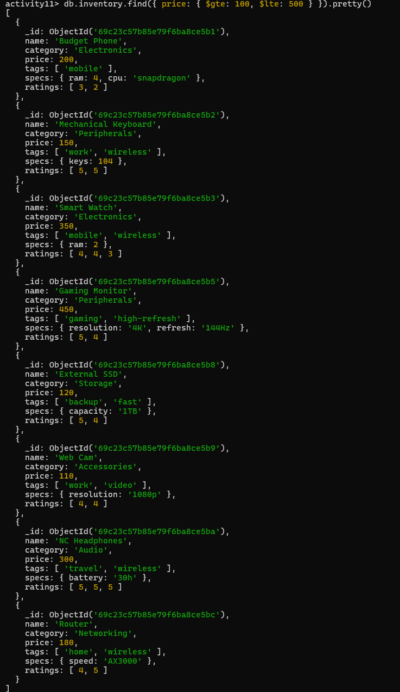
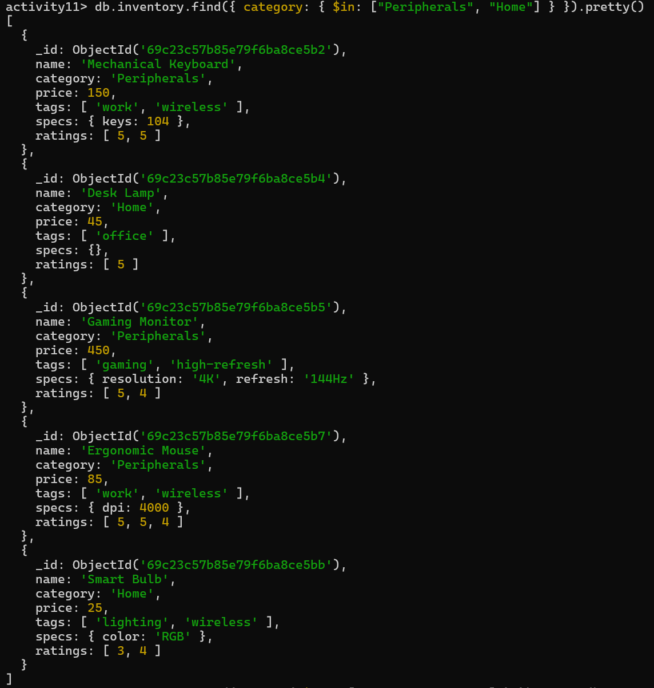
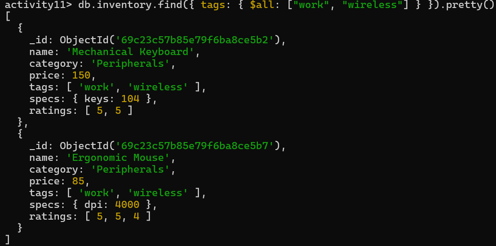
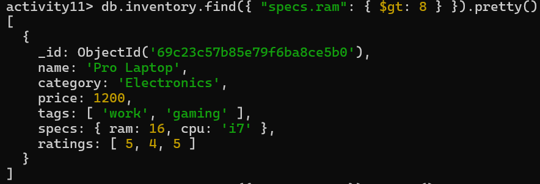
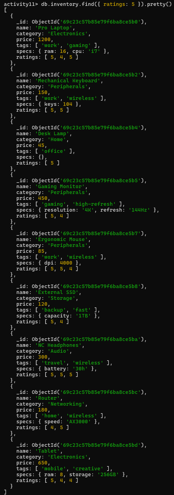

# Activity 11: SQL to MongoDB & Advanced Querying - Answer Template

## Part 1: Relational to Document Modeling

### 1. Proposed JSON Schema
```json
// Provide your single document structure here
{
  "_id": ObjectId(),
  "title": "Understanding MongoDB",
  "body": "This post explains MongoDB basics...",
  "created_at": ISODate(),
  "author": {
    "user_id": 1,
    "username": "daryl",
    "email": "daryl@gmail.com",
    "bio": "cutie-cutie"
  },
  "tags": [
    { "tag_id": 1, "name": "mongodb" },
    { "tag_id": 2, "name": "nosql" }
  ]
}
```

### 2. Strategic Choices
*   **Tags:** Embed 
*   **Author:** Embed 

### 3. Justification
> Tags are embedded because they are small and frequently accessed together with posts, which improves read performance. Author data is embedded to avoid joins and allow faster retrieval of post and author information in a single query. Although this duplicates some data, it is acceptable because author data rarely changes.
---

## Part 2: Querying with MQL Operators

### 1. Price Range
*Find all items priced between $100 and $500 (inclusive).*
```javascript
// Your MQL Command
db.inventory.find({ price: { $gte: 100, $lte: 500 } }).pretty()
```

### 2. Category Match
*Find all items that are in either the "Peripherals" or "Home" categories.*
```javascript
// Your MQL Command
db.inventory.find({ category: { $in: ["Peripherals", "Home"] } }).pretty()
```

### 3. Tag Power
*Find all items that have **both** the "work" AND "wireless" tags.*
```javascript
// Your MQL Command
db.inventory.find({ tags: { $all: ["work", "wireless"] } }).pretty()
```

### 4. Nested Check
*Find all items where the `specs.ram` is greater than 8GB.*
```javascript
// Your MQL Command
db.inventory.find({ "specs.ram": { $gt: 8 } }).pretty()
```

### 5. High Ratings
*Find all items that have at least one `5` in their `ratings` array.*
```javascript
// Your MQL Command
db.inventory.find({ ratings: 5 }).pretty()
```

---

## Screenshots

### Insert Data


### Query 1: Price Range


### Query 2: Category Match


### Query 3: Tag Power


### Query 4: Nested Check


### Query 5: High Ratings
