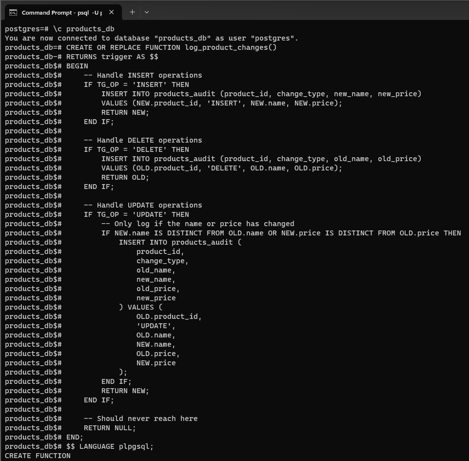
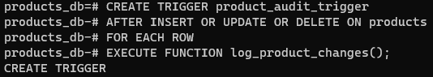
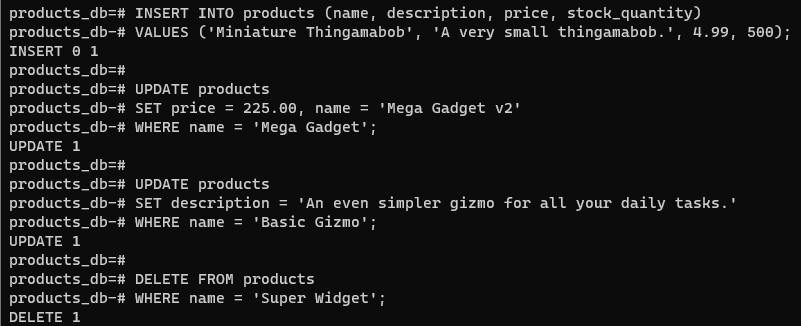
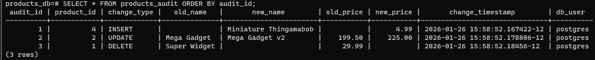

# Week 3 - Lab1

# Task 1 --Create the Trigger Function

# Task 2 --Create the Trigger Definition

# Task 3 --Test Your Trigger
# 1. Test the INSERT trigger
# 2. Test the UPDATE trigger (with a meaningful change)
# 3. Test an UPDATE with no meaningful change (should not create a log entry)
# 4. Test the DELETE trigger

# Task 4 --Verify the Results

