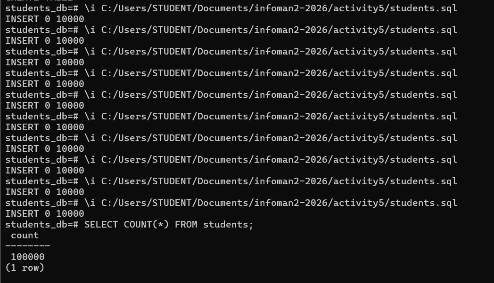
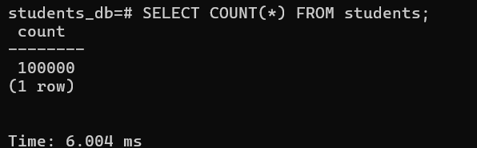
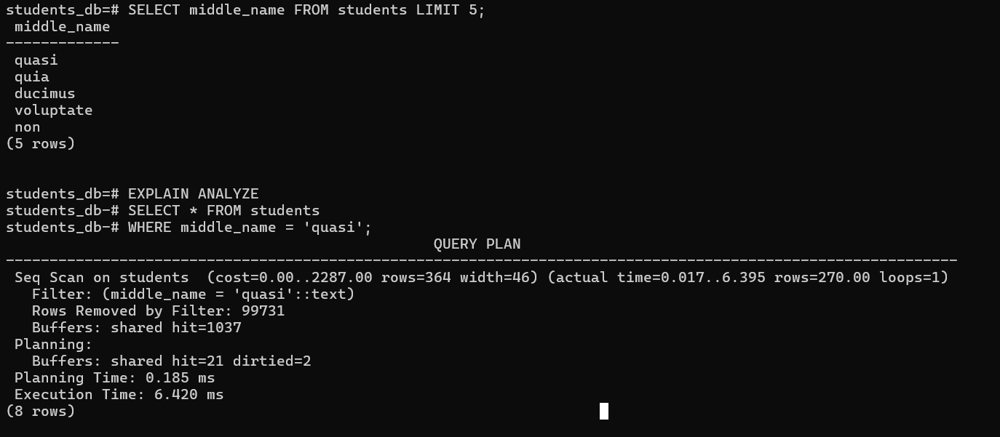
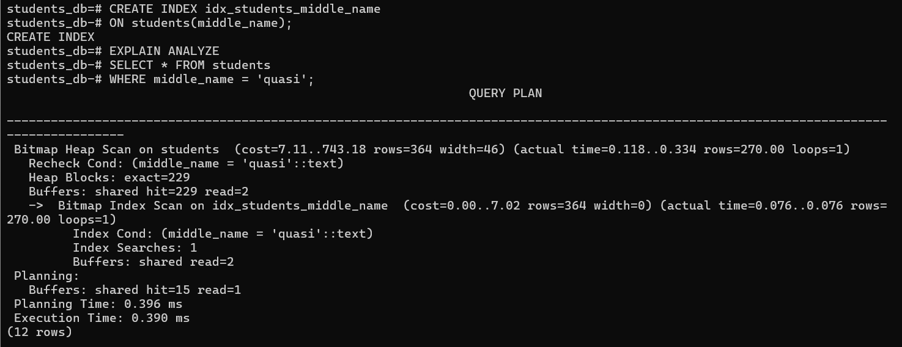
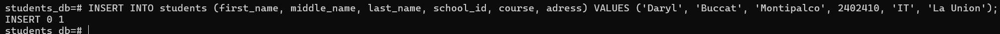

# Activity 5
# Part 1

# Part 2

# Part 3

# Part 4

# -----------------------------------------------------------------------------------------------
# Analysis Questions
# Fill in the following with your recorded measurements.

# Initial Data Insertion Time (1,000,000 rows):  6.004 ms
# Query Execution Time (Non-Indexed):  6.420 ms
# Query Execution Time (Indexed): 0.390 ms
# Single Row Insertion Time (With Index): 1.317 ms

# -----------------------------------------------------------------------------------------------

# Answer the following questions:
# 1.How did the query execution time change after creating the index? Was it faster or slower? By approximately how much?
# -After creating the index, the query execution time became much faster, decreasing from 6.420 ms to 0.390 ms, which is roughly a 16-fold improvement.

# 2.Why do you think the query performance changed as you observed?
# -The query performance improved because the index allowed PostgreSQL to locate matching rows directly using an index scan instead of scanning every row sequentially.

# 3.What is the trade-off of having an index on a table? (Hint: Compare the initial bulk insertion time with the single row insertion time after the index was created).
# -The trade-off of having an index is that while queries run faster, insertions, updates, and deletions become slightly slower because the index must be maintained, and it consumes additional storage.